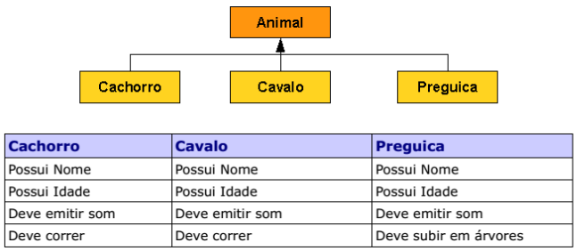

# Tarefa 011 - Polimorfismo - 22/05/2023

1. Exercício 01:

1.1 Crie uma hierarquia de classes conforme abaixo com os seguintes atributos e comportamentos (observe a tabela), utilize os seus conhecimentos e distribua as características de forma que tudo o que for comum a todos os animais fique na classe Animal:

  

1.2. Implemente uma classe de teste, **AnimalTeste** que crie os 3 tipos de animais definidos no exercício anterior e invoque o método que emite o som de cada um de forma polimórfica, isto é, independente do tipo de animal.

1.3. Implemente uma classe **Veterinario** que contenha um método **examinar()** cujo parâmetro de entrada é um Animal, quando o animal for examinado ele deve emitir um som, passe os 3 animais com parâmetro.

1.4. Crie uma classe **Zoologico**, com 10 jaulas (utilize um array) coloque em cada jaula um animal diferente, percorra cada jaula e emita o som e, se o tipo de animal possuir o comportamento, faça-o correr.

2. Exercício 02:

2.1 Crie uma classe chamada **Produto** que possua os atributos "nomeloja" e "preco", crie os métodos _sets_ e _gets_ para estes atributos. Crie também o atributo "descricao" e seu método chamado _getDescricao()_ que retorna uma _string_ com o simples conteúdo "Produto de informática".

2.2 Crie duas classes filhas de **Produto**, que sendo a primeira nominada de **Mouse** e possuindo o atributo "tipo" (string) e a segunda nominada **Livro** com o atributo "autor" (string), no método construtor de cada uma dessas classes passe como argumento a descrição desse produto, por exemplo, Mouse(“Mouse ótico, Saída USB. 1.600 dpi”); Crie o método _getDescricao()_ que retorna a descrição que foi passada no argumento do construtor concatenada com o atributo que a classe tiver, "autor" no caso de livro e "tipo" no caso de mouse, esse método deve ter a mesma assinatura do método _getDescricao()_ da classe pai “Produto”.

2.3 Crie a classe **ProdutoTeste** (deverá ser executável) que irá simular a compra de um cliente de vários mouses e livros, deve haver apenas uma lista, nesta classe para armazenamento de todos os livros e mouses. Essa lista deverá se chamar "carrinho" que simula o carrinho de compras de produtos variados de um cliente em um _e-commerce_. Insira nesse "carrinho" vários mouses e livros e depois chame o método _getDescricao()_ de todos os objetos presentes na lista, para o usuário do carrinho saber as informações dos produtos em seu carrinho.

**INSTRUÇÕES**
1. O uso de orientação a objetos e pre-requisito para esta implementação;
2. A linguagem de programação pode ser a da preferência do aluno;
3. A entrega deve ser feita no seu repositório pessoal, utilizado para a disciplina, dentro de uma pasta chamada **tarefa011**.
4. Não devem ser _commitados_ os arquivos de configuração local, arquivos compilados, etc. Estes devem estar adicionados ao arquivo _'.gitignore'_.
5. Implementar apenas um dos dois exercícios (1 ou 2). Se quiser implementar os dois, fique à vontade.
5. O prazo para entrega desta tarefa é as 23h59min do dia 24/05/2023.
